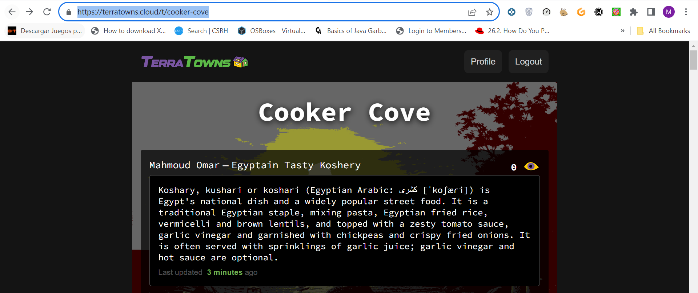
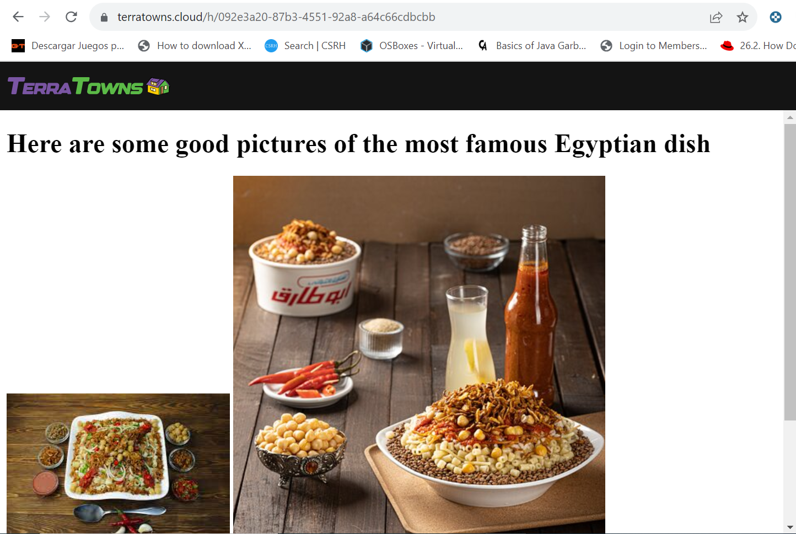

# Terraform Beginner Bootcamp 2023

# Final Outcome 

This was deployed in [Cooker-Cove](https://terratowns.cloud/t/cooker-cove) and can be accessed from [My Final Submission](https://terratowns.cloud/h/092e3a20-87b3-4551-92a8-a64c66cdbcbb)





## Week0
[Week0](journals/week0.md)

## Week1
[Week1](journals/week1.md)

## Week2
[Week2](journals/week2.md)

## Extra

The ToC was created by easy-to-use extension called Markdown All in One that can make the TOC for any .md file in an instant.

The below extension need to be added to gitpod.yaml
```
- yzhang.markdown-all-in-one
```

